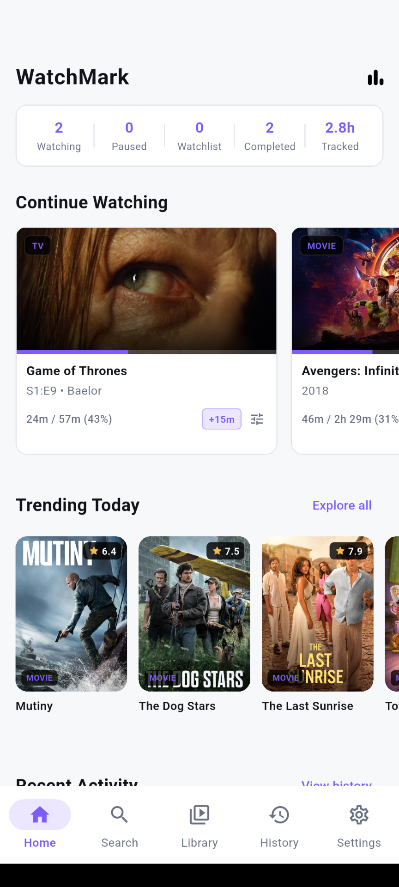
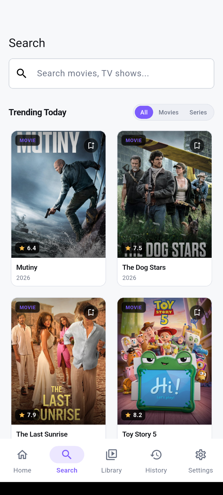
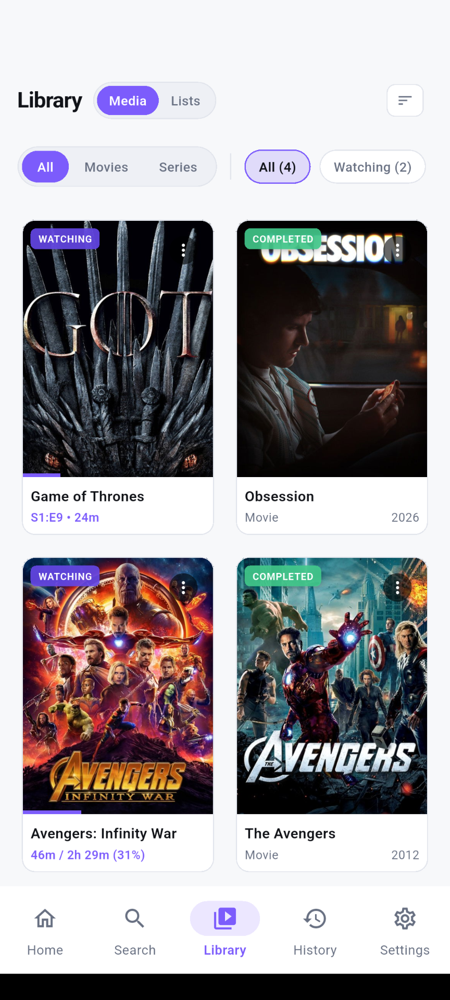
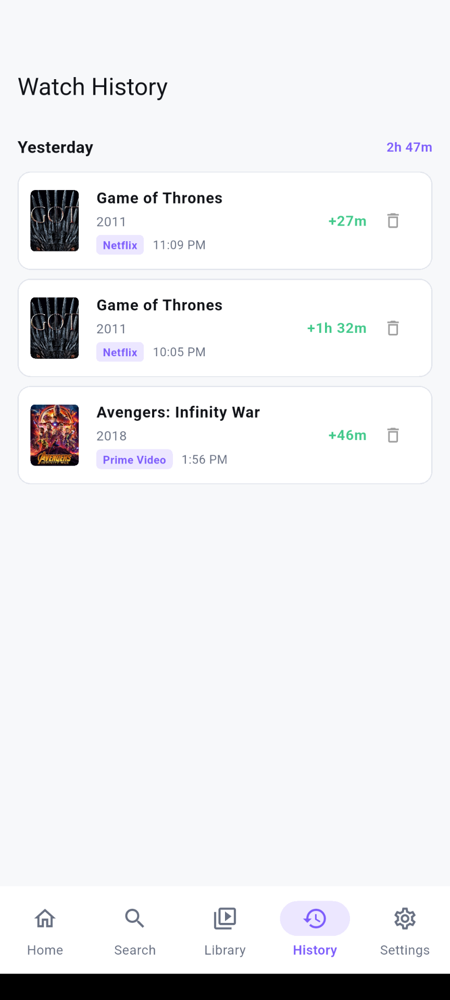
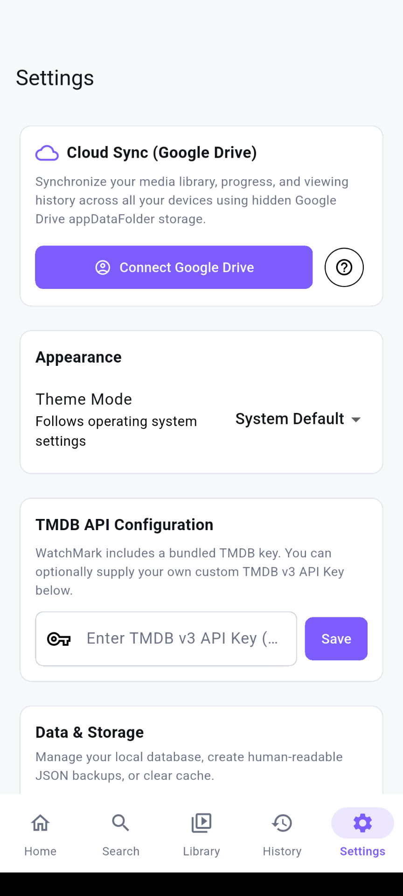
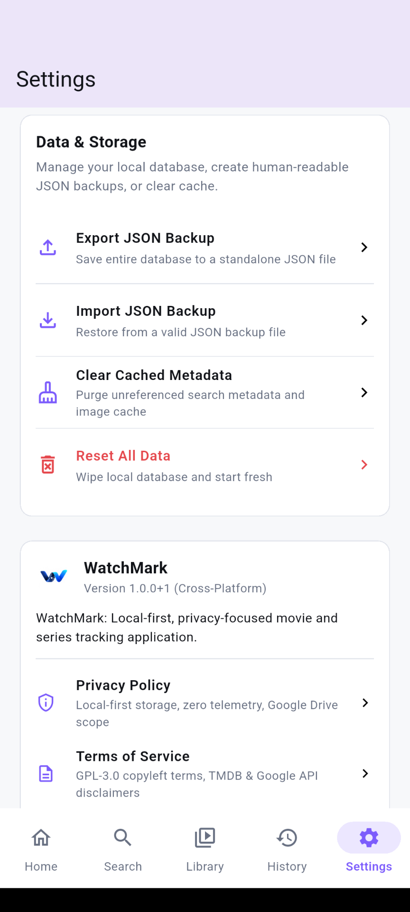
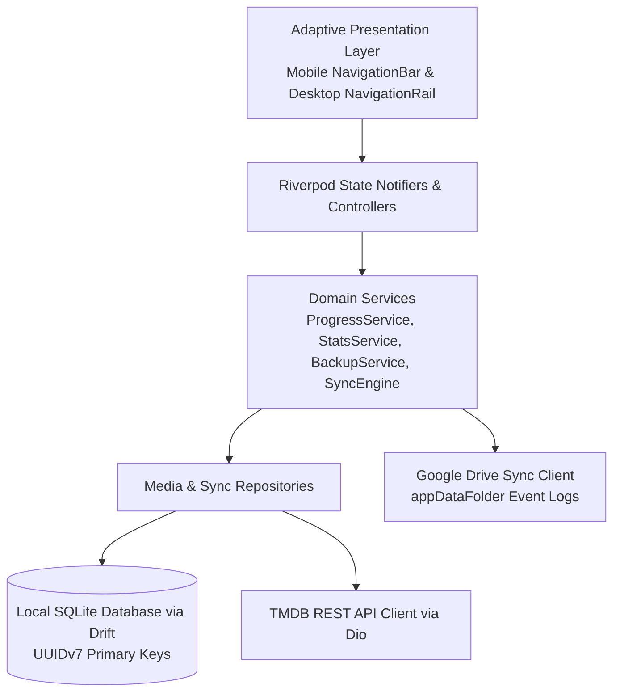

<div align="center">


# WatchMark

**Local-First, Privacy-Centric Movie & Series Tracking for Mobile and Desktop**

[](https://www.gnu.org/licenses/gpl-3.0) [](https://flutter.dev) [](https://dart.dev) [](https://sqlite.org) [](https://riverpod.dev) [](https://www.themoviedb.org)

<br />

WatchMark is an open-source, local-first media tracker engineered for Android, Windows, Linux, and macOS. It provides precise minute-by-minute progress tracking, watch session logging, curated custom lists, and comprehensive viewing analytics without telemetry, tracking ads, or mandatory account creation.

</div>

---

## App Screenshots

<div align="center">

| Home Dashboard | Search & Discovery | Media Library |
|:---:|:---:|:---:|
|  |  |  |

| Watch History | Cloud Sync & Settings | Storage & Privacy |
|:---:|:---:|:---:|
|  |  |  |

</div>

---

## Key Highlights

- **Timestamp-Accurate Progress:** Track movies and TV episodes down to the exact minute. Scrub with the slider, tap quick increments (`+5m`, `+15m`, `+30m`), or enter exact timestamps.
- **Local-First & Private:** Your device is always the single source of truth. Data is persisted in a local SQLite database via Drift with collision-resistant UUIDv7 primary keys.
- **Seamless Cloud Sync:** Optional peer-to-peer cloud synchronization via Google Drive `appDataFolder` using immutable event logs and deterministic conflict resolution.
- **Rich Media Discovery:** Direct integration with TMDB API for cast, crew, season breakdowns, episode guides, backdrops, and high-resolution posters.
- **Comprehensive Analytics:** Track total hours watched, monthly consumption trends, streaming platform distribution, and top genres.
- **Adaptive UI/UX:** First-class responsive layouts tailored for both touch screens (Mobile Navigation Bar) and mouse/keyboard workflows (Desktop Navigation Rail & Shortcuts).
- **Curated Custom Lists:** Organize titles into ranked or unranked custom collections with custom notes.

---

## Feature Tour

### 1. Home Dashboard & Continue Watching
- **Top Metrics Bar:** Instant visibility into titles currently *Watching*, *Paused*, in *Watchlist*, *Completed*, and total lifetime *Tracked* hours.
- **Continue Watching Carousel:** Dynamic stream of all in-progress media with interactive quick increment (`+15m`) controls and progress percentage bars.

### 2. Unified Media Library
- **Status Filtering:** Quickly pivot between *All*, *Watching*, *Watchlist*, *Paused*, *Completed*, and *Dropped*.
- **Media Filters & Sorting:** Toggle between Movies and TV Series with multi-criteria sorting (Title, Release Date, Last Watched, Rating).
- **Progress Indicators:** Live progress bar overlay and elapsed time readouts directly on library cards.

### 3. Granular Progress & Session Logging
- **Platform Tagging:** Tag viewing sessions to specific streaming providers (Netflix, Prime Video, Disney+, Apple TV+, Max, Hulu, Crunchyroll, YouTube, Local Media).
- **Non-Destructive Bookmark Updates:** Distinguishes forward viewing progress (which records viewing sessions) from backward corrections without distorting historical statistics.

### 4. Viewing Analytics & Insights
- **Total Watch Time:** Calculated across all individual sessions with day, week, and all-time aggregations.
- **Platform Breakdown:** Interactive visual distribution of time spent across different streaming services.
- **Top Genres & Monthly Trends:** Multi-month bar graphs displaying seasonal consumption habits.

### 5. Data Ownership & Backup
- **JSON Backup / Restore:** One-click export and import of your entire watch history and library.
- **Smart Merge Conflict Resolution:** Choose between smart merge or database overwrite during backup restore.
- **Metadata Cache Management:** Purge unreferenced cached artwork and metadata to keep local storage minimal.

---

## Architecture & System Design

WatchMark follows a layered, reactive architecture built on Flutter and Riverpod:



### Core Technologies

| Layer | Technology | Rationale |
|---|---|---|
| Framework | Flutter 3.24+ / Dart 3.5+ | Single codebase delivering 60fps performance on Android & Desktop. |
| State Management | `flutter_riverpod` | Reactive, compile-time safe dependency injection and stream integration. |
| Persistence | `drift` + `sqlite3_flutter_libs` | Type-safe SQL queries, reactive streams, and schema migrations. |
| Networking | `dio` | Interceptors, structured error handling, and API rate limiting. |
| Cloud Sync | `googleapis` (`appDataFolder`) | Private sync using event sourcing delta logs without custom servers. |
| Serialization | `freezed` + `json_serializable` | Immutable data structures and compile-time JSON encoding. |

---

## Desktop Keyboard Shortcuts

| Shortcut | Destination / Action |
|---|---|
| `Ctrl + 1` | Navigate to Home |
| `Ctrl + 2` | Navigate to Search |
| `Ctrl + 3` | Navigate to Library |
| `Ctrl + 4` | Navigate to Watch History |
| `Ctrl + 5` | Navigate to Settings |
| `Ctrl + F` | Quick Search Focus |

---

## Getting Started

### Prerequisites

- Flutter SDK (version `^3.24.0` or higher)
- Dart SDK (version `^3.5.0` or higher)
- A TMDB API Key (optional for development, or configure in Settings)

### Installation & Run

1. **Clone the repository:**
   ```bash
   git clone https://github.com/your-username/watchmark.git
   cd watchmark
   ```

2. **Install dependencies:**
   ```bash
   flutter pub get
   ```

3. **Run code generation (Drift & Freezed):**
   ```bash
   dart run build_runner build -d
   ```

4. **Launch the application:**
   - **Windows:**
     ```bash
     flutter run -d windows
     ```
   - **Linux:**
     ```bash
     flutter run -d linux
     ```
   - **macOS:**
     ```bash
     flutter run -d macos
     ```
   - **Android:**
     ```bash
     flutter run -d <device_id>
     ```

---

## Quality Assurance & Verification

WatchMark includes a complete test suite covering unit tests, DAO transactions, sync engines, and responsive widget rendering:

```bash
# Run static analysis
flutter analyze

# Run all unit and widget tests
flutter test
```

---

## License & Legal
 
- **License:** Distributed under the **GNU General Public License v3.0 (GPL-3.0)**. See the [LICENSE](LICENSE) file for complete details.
- **Privacy Policy:** Read our privacy guarantees in [PRIVACY.md](PRIVACY.md).
- **Terms of Service:** Review the terms and third-party disclaimers in [TERMS.md](TERMS.md).
